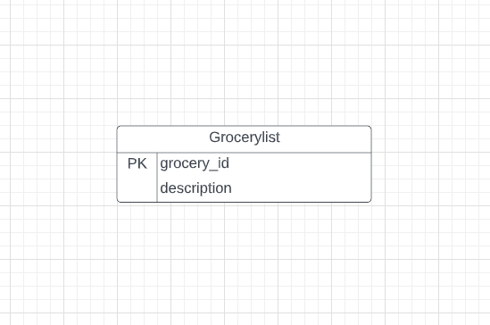
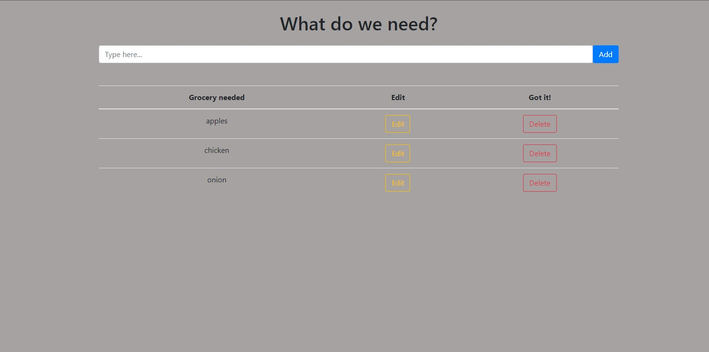

# A grocery list app demonstrating/practicing both front and back-end skills.

## Routes used in the database
1) app.post("/groceries"), to make a new item.
    - This route inserts into the table the new value/s added by user then returns the value/s.
2) app.get("/groceries"), to get all items.
    - This route selects all from the table.
3) app.get("/groceries"), to get one item.
    - This route selects one item from the table by a specific ID that is provided by the user.
4) app.put("/groceries"), to update item.
    - This route selects the list item by ID then updates the description. 
5) app.delete("/groceries"), to delete an item.
    - This route selects the list item by ID then deletes the item from the table.
    
 ## Main Tech Stack
 Database   | API     | Front-End | Styling   
---------- | ------- | --------- | ----------- 
Postgresql | Node.js | React     | Styled Components 

## ERD

## How to set up the server
* After opening the database.sql file in the sever folder and launching the psql shell login
    - User: 'postgres'
    - Host: 'localhost'
    - Password: your password
    - Port: 5432
    - Database: 'grocerylist'
    
* Copy and paste line 1 of database.sql into the shell and create the database.
* Connect to the database you just created then copy and paste lines 3-6 in the database.sql file into the psql shell to create the table.
* Your server is now ready for use!

## Getting the app started
* Open up this code in your preferred IDE.
* Launch the first terminal.
  - cd into server.
  - Enter to set up "npm i express pg cors".
  - Then enter "nodemon index".
 
* Launch the second terminal.
  - cd into front-end.
  - Then enter "npm start".
 
## How to use the app
* Type into the input box and click the Add button.
* To edit these list items click the Edit button and in the modal’s input box then edit as needed or hit Close if you did not intend to edit this item.
* To delete an item click the Delete button.

